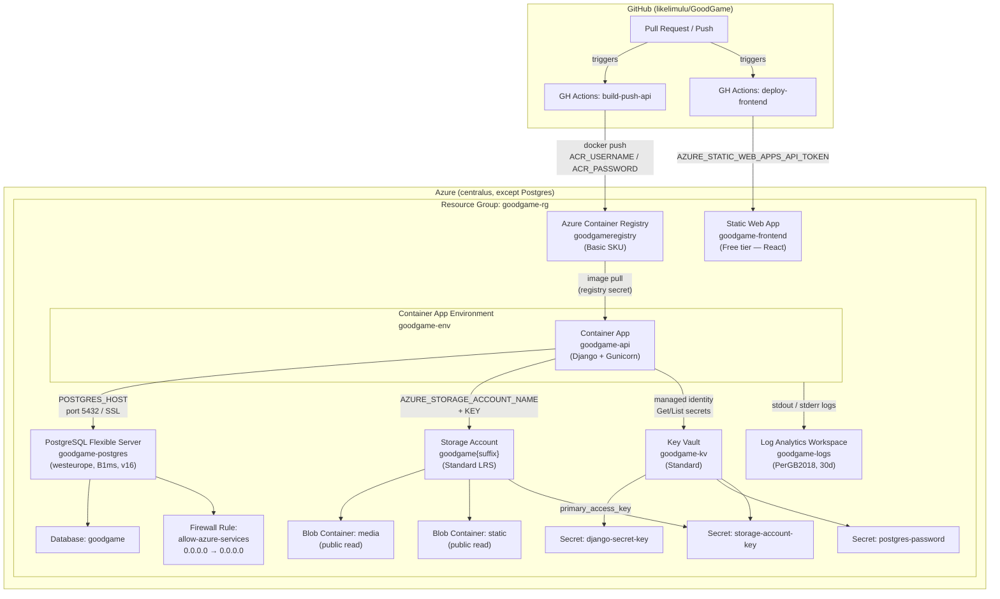

# GoodGame — Azure Infrastructure Architecture

## Resource summary

| Resource | Type | Region | Notes |
|---|---|---|---|
| goodgame-rg | Resource Group | centralus | Parent for all resources |
| goodgame-logs | Log Analytics Workspace | centralus | 30-day retention |
| goodgame-env | Container App Environment | centralus | Linked to Log Analytics |
| goodgame-api | Container App | centralus | Django API, scale-to-zero |
| goodgameregistry | Container Registry | centralus | Basic SKU, admin enabled |
| goodgame-frontend | Static Web App | centralus | Free tier, React SPA |
| goodgame-postgres | PostgreSQL Flexible Server | **westeurope** | B1ms, v16 (free-trial workaround) |
| goodgame (DB) | PostgreSQL Database | westeurope | UTF8, en_US.utf8 |
| goodgame{suffix} | Storage Account | centralus | Standard LRS |
| media | Blob Container | centralus | Public blob read |
| static | Blob Container | centralus | Public blob read |
| goodgame-kv | Key Vault | centralus | Standard SKU |

## GitHub Actions secrets required

| Secret | Source |
|---|---|
| `AZURE_CREDENTIALS` | Service principal JSON (`az ad sp create-for-rbac`) |
| `ACR_LOGIN_SERVER` | `terraform output container_registry_login_server` |
| `ACR_USERNAME` | `terraform output -raw container_registry_admin_username` |
| `ACR_PASSWORD` | `terraform output -raw container_registry_admin_password` |
| `AZURE_STATIC_WEB_APPS_API_TOKEN` | `terraform output -raw static_web_app_api_key` |
| `DJANGO_SECRET_KEY` | Generate: `python -c "import secrets; print(secrets.token_urlsafe(50))"` |
| `POSTGRES_PASSWORD` | Same value as `TF_VAR_postgres_admin_password` |
| `AZURE_STORAGE_ACCOUNT_KEY` | `terraform output` → storage account primary key |
